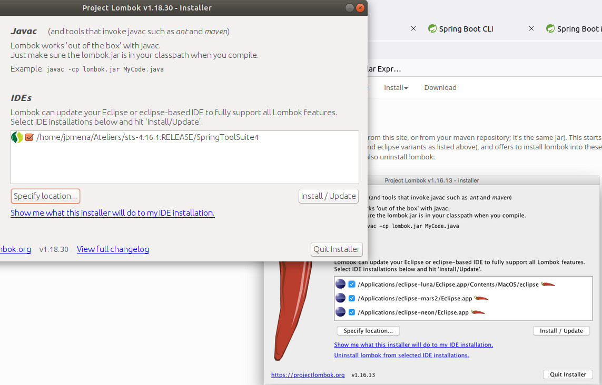
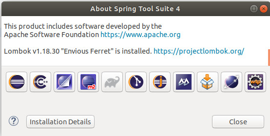

# Lombok

* generates getters setters and constructors at compile time so that they are available at runtime...
  * it is used here to keep the Book Examples short and sweet
  * here to keep Ingredient slim and trim
  
* Updating the POM through the SpringMenu
  * makes resolving dependencies never stop
  * I had to kill (in the Linux terminal) sts processes
* Lombok does not solve the IDE's problem (STS)
  * The three final private fields appear as never initialized
  
* We exclude Lombok from the jar or war to be delivered
  * by excluding from the [_spring-boot-maven-plugin_](https://docs.spring.io/spring-boot/docs/current/maven-plugin/reference/htmlsingle/) build plugin
  
```xml
<plugin>
	<groupId>org.springframework.boot</groupId>
	<artifactId>spring-boot-maven-plugin</artifactId>
	<configuration>
		<excludes>
			<exclude>
				<groupId>org.projectlombok</groupId>
				<artifactId>lombok</artifactId>
			</exclude>
		</excludes>
	</configuration>
</plugin>
```

* with the following command I verify that lombok is not in the packaged jar

```bash
# No lombok the generated jar file
jpmena@jpmena-ThinkCentre-M710t:~/Documents/workspace-spring-tool-suite-4-4.16.1.RELEASE/taco-cloud/target$ unzip -l taco-cloud-0.0.1-SNAPSHOT.jar | grep -i lombok
```

* but it i well in my _.m2/repository_:
  * I added it today (09/11/2023) on my pom.xml
  * so it is the  __1.18.30__ version
  * this is confirmed by the Maven Dependencies on my project on STS

```bash
jpmena@jpmena-ThinkCentre-M710t:~$ ll .m2/repository/org/projectlombok/lombok/
total 24
drwxrwxr-x 6 jpmena jpmena 4096 nov.   9 13:09 ./
drwxrwxr-x 3 jpmena jpmena 4096 janv. 26  2021 ../
drwxrwxr-x 2 jpmena jpmena 4096 janv. 29  2021 1.18.16/
drwxrwxr-x 2 jpmena jpmena 4096 nov.   8 15:45 1.18.20/
drwxrwxr-x 2 jpmena jpmena 4096 déc.  23  2021 1.18.22/
drwxrwxr-x 2 jpmena jpmena 4096 nov.   9 13:09 1.18.30/
jpmena@jpmena-ThinkCentre-M710t:~$ ll .m2/repository/org/projectlombok/lombok/1.18.30/
total 2976
drwxrwxr-x 2 jpmena jpmena    4096 nov.   9 13:09 ./
drwxrwxr-x 6 jpmena jpmena    4096 nov.   9 13:09 ../
-rw-rw-r-- 1 jpmena jpmena 2011339 nov.   9 13:09 lombok-1.18.30.jar
-rw-rw-r-- 1 jpmena jpmena      40 nov.   9 13:09 lombok-1.18.30.jar.sha1
-rw-rw-r-- 1 jpmena jpmena    1484 nov.   9 13:09 lombok-1.18.30.pom
-rw-rw-r-- 1 jpmena jpmena      40 nov.   9 13:09 lombok-1.18.30.pom.sha1
-rw-rw-r-- 1 jpmena jpmena  998357 nov.   9 13:09 lombok-1.18.30-sources.jar
-rw-rw-r-- 1 jpmena jpmena      40 nov.   9 13:09 lombok-1.18.30-sources.jar.sha1
-rw-rw-r-- 1 jpmena jpmena     111 nov.   9 13:09 m2e-lastUpdated.properties
-rw-rw-r-- 1 jpmena jpmena     226 nov.   9 13:09 _remote.repositories
```

## The IDE complains

* Lombok does not solve the IDE's problem (STS)
  * The three final private fields appear as never initialized
* _Lombok annotations (such as @Data  at development time and with automatic method generation at compile time_
* _But you’ll
also need to add Lombok as an extension in your IDE, or your IDE will complain, with
errors about missing methods and final properties that aren’t being set_

### Following the official documentation

* [Installing Lombok on Eclipse Studios (includes STS)](https://projectlombok.org/setup/eclipse)

```bash
jpmena@jpmena-ThinkCentre-M710t:~$ cd .m2/repository/org/projectlombok/lombok/1.18.30/
jpmena@jpmena-ThinkCentre-M710t:~/.m2/repository/org/projectlombok/lombok/1.18.30$ java -jar lombok-1.18.30.jar
```
* it does not find my STS location
* to get the STS installation folder
  * Go To _Help / About ..._
  * click on _Installation details_
  * _Configuration_ Tab
* the Result is the launcher _/home/jpmena/Ateliers/sts-4.16.1.RELEASE/SpringToolSuite4_

* Launching the Lombok jar gives


* it copies the _~/.m2/repository/org/projectlombok/lombok/1.18.30/lombok-1.18.30.jar_ as __/home/jpmena/Ateliers/sts-4.16.1.RELEASE/lombok.jar_
* and add a javaagent into the _~/Ateliers/sts-4.13.0.RELEASE/SpringToolSuite4.ini_ file

#### Restart STS 
* To check that lombok has been effectively installed Go to __Help / About ...__
  * and please use the right scrollbar (in the downward direction) to have the followong Lombaok's message

* and Please Do a __Project / clean__ (which calls for a rebuild)

## p 61/520
* the magic with Lombok added to the STS is that private attribute have at first a STS,s warning
  *  unused (light orange underline)
  * that warning disappear when @Data added
  
* In the outline, and in the package explorer
  * the getter, setters, and constructor automatically appear 

# 62/520
* @ModelAttribute without parameter is for a method which receives a *Model* object and returns void
  * The Model object is to be populated with key values for model's attributes objects
  	* one Attribute in this case for each Ingredient's type
  	* that is why we couldn't just return an object
* *@ModelAttribute(name="xxxx")* must return an object that will be 
  * added to the model object with the key "xxxx"
* anyway: the function's name does not matter ...

## Running through an enum

* test in local jshell (Java 17)

```java
jshell> public enum Type {
   ...>     WRAP, PROTEIN, VEGGIES, CHEESE, SAUCE
   ...> }
|  created enum Type

jshell> Type[] types = Type.values()
types ==> Type[5] { WRAP, PROTEIN, VEGGIES, CHEESE, SAUCE }

jshell> System.out.println(types[3])
CHEESE
jshell> System.out.println(types[3].toString())
CHEESE

jshell> System.out.println(types[3].toString().toLowerCase())
cheese

jshell> System.out.println(types[3].toLowerCase())
|  Error:
|  cannot find symbol
|    symbol:   method toLowerCase()
|  System.out.println(types[3].toLowerCase())
|                     ^------------------^

jshell> System.out.println(types[3].name().toLowerCase())
cheese
```
## FilterByType
* from [List to stream](https://www.geeksforgeeks.org/program-to-convert-list-to-stream-in-java/)
  * just use the *stream* method
* from [stream to List](https://www.baeldung.com/java-stream-to-list-collecting)
  * Three possibilities

# 63 / 520

* the session attribute *@SessionAttributes("tacoOrder")*
* and the *@model(name="tacoOrder")* are related
  * *This indicates that the TacoOrder object that is put into the model a little later in the class should be maintained in session*

#65
* [difference between th:text and th:value](https://www.baeldung.com/java-thymeleaf-text-vs-value)
* th:text makes the replacement in the _innerHtml_ of the element
* ${xxx} is to get the value of the xxx model attribute
* the two are unrelated

#66
* when I create a new File with a html extension
* I can't use the html auto completion STS gets stuck
  * it happened 3 times

## Adding the Tymeleaf extension form the store (does not work behind a proxy)
* This is the first proposed solution by this [post StackOverflow](https://stackoverflow.com/questions/66775096/html-file-not-showing-in-select-wizard-in-spring-tool-suite)
* Help / eclipse Marketplace 
* Enter *Thymeleaf*
* I does not work behind the corporation's proxy

## Adding new Software
* this is the second proposition of this [post StackOverflow](https://stackoverflow.com/questions/66775096/html-file-not-showing-in-select-wizard-in-spring-tool-suite)
* I did not find Eclipse Web Developper Tools
* That solution is very unstable in my STS 4
* I did'nt have syntaxic coloration

## I updated to the [4.20.1 STS version](https://spring.io/tools)

* I still have to reinstall Lombok see the first chapter called **Lombok**
* the completion does not work, but at least it does not freeze STS

## When I eccess _http://localhost:8080/design_
* I had an error
* because it is not:
 
```html
<input th:field="*{ingredients}" type="checkbox" 
               th:value="{ingredient.id}"/>
```

* but (don't forget the _$_ for a read variable !!!:
```html
<input th:field="*{ingredients}" type="checkbox" 
               th:value="${ingredient.id}"/>
```
* Note that STS does hot-reload (not need of a restart)

## Good explaination of the asterisk syntax when using variables
* see [this article](https://o7planning.org/12385/thymeleaf-th-object-and-asterisk-syntax)
* in our case th _th:object_ is _{taco}_ defined by the _form_ element.
* the __th:field_ reason is given by [2.2 from this page](https://frontbackend.com/thymeleaf/working-with-forms-in-thymeleaf)

```html
<form th:action="@{/registration}" th:object="${registration}" method="post">
    ...
    <input type="text" th:field="*{username}" />
</form>
```
* here when we input a value it goes to _registration.username_
* In our case the chekboxes are meant to fill the array _taco.ingredients_
* the [chapter 2.3 of thei page](https://frontbackend.com/thymeleaf/working-with-forms-in-thymeleaf)
  * takes the case of checkboxes

### What about [#ids](https://medium.com/@grokwich/spring-boot-thymeleaf-html-form-handling-762ef0d51327)

> The #ids.prev() function is used to generate a unique Input field id attribute by appending a base-1 sequence id to the name multiCheckboxSelectedValues (id=”multiCheckboxSelectedValues1", id=”multiCheckboxSelectedValues2", etc…).

### displaying error message:
* [th:errors at paragraph 3.1](https://www.baeldung.com/spring-thymeleaf-error-messages)

## theming the design page:

*I refer to the [style.css on the GitHub Website](https://github.com/habuma/spring-in-action-6-samples/blob/main/ch02/taco-cloud/src/main/resources/static/styles.css)
* adding border-box makes two groups of ingredients can be on the same line
* the _grid:after_ is only there to start a new Line after the grid. __display:table__ is an old way of doing it...
  * I can test it adding replacing the empty content with _Hello_
  * there must be a content even empty!!!
```
