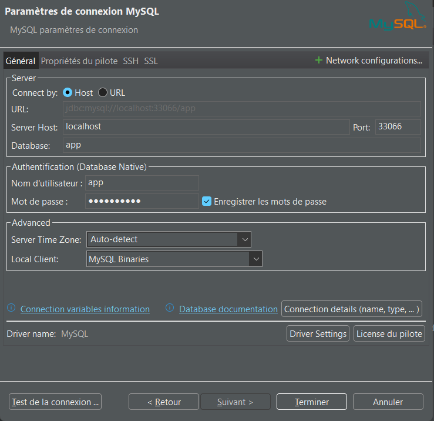

# Starting/Stopping the containers in Docker4Windows/WSL:
## prerequisites
* On Your Windows computer click on the [Docker4Windows](https://docs.docker.com/desktop/setup/install/windows-install/) Icon to start it
  * By default it uses your [WSL2](https://learn.microsoft.com/en-us/windows/wsl/about) as the Host engine (in my case Ubuntu 24.04)
* Symfony Container must have been installed. See [Installing Symfony Container](./1-InstallingSymfonyDocker.md)
* The Symfony recipe to add a Mysql8 container must have been played. See [Adding the Database Container through a recipe](./2-InstallingMysqlDocker.md)
* The 2 images are present:
```bash
jpmena@LAPTOP-E2MJK1UO:~/CONSULTANT/symfony-docker$ docker image ls
REPOSITORY   TAG       IMAGE ID       CREATED       SIZE
app-php      latest    69be3a10ae50   7 days ago    957MB # The Sumfony app image
mysql        8         5367102acfef   3 weeks ago   1.07GB # The Database image
```
### Important !!!
* To have the correct version of docker and the images you just created, please **start [the Docker For Windows graphical application (on you Windows Host)](https://docs.docker.com/desktop/setup/install/windows-install/)**
## Starting the containers from WSL
* Go to the root of you Symfony project on the Host
  * and pass the following command
```bash
jpmena@LAPTOP-E2MJK1UO:~/CONSULTANT/symfony-docker$ docker compose up --wait
[+] Running 3/3
 ✔ Network symfony-docker_default       Created                                                                                        0.1s 
 ✔ Container symfony-docker-database-1  Healthy                                                                                        6.4s 
 ✔ Container symfony-docker-php-1 Healthy                                                                                        6.4s
 ```
 * windows just asks for a permission (Windows popup) to share the Network between the Host and the conainers
## Stopping the containers from WSL
* Go to the root of you Symfony project on the Host
  * and pass the following command
```bash
jpmena@LAPTOP-E2MJK1UO:~/CONSULTANT/symfony-docker$ docker compose down
[+] Running 3/3
 ✔ Container symfony-docker-php-1       Removed                                                                                        0.5s 
 ✔ Container symfony-docker-database-1  Removed                                                                                        1.0s 
 ✔ Network symfony-docker_default       Removed
```
# Accessing Symfony and the Database from the Host
## Accessing the Symfony WebSite 
* [see](./1-InstallingSymfonyDocker.md)
* HTTPS Ports have been published from the container to the Host
## Accessing the mysql Database from the host
* [see](./2-InstallingMysqlDocker.md)
* calls localhost in HTTPS and acceots the local certificate 
  * on my Windows' Chrome I enter the https://localhost/ url
## from the WSL mysql client
* port 33066 has been exported
* use 127.0.0.1 and not localhost
```bash
jpmena@LAPTOP-E2MJK1UO:~$ mysql --host=127.0.0.1 --user=app --port=33066 --password='!ChangeMe!' app # simple quotes mandatory for the password !!!
mysql: [Warning] Using a password on the command line interface can be insecure.
Welcome to the MySQL monitor.  Commands end with ; or \g.
Your MySQL connection id is 33
Server version: 8.4.6 MySQL Community Server - GPL

Copyright (c) 2000, 2025, Oracle and/or its affiliates.

Oracle is a registered trademark of Oracle Corporation and/or its
affiliates. Other names may be trademarks of their respective
owners.

Type 'help;' or '\h' for help. Type '\c' to clear the current input statement.

mysql>
``` 
### from DBeaver installed on the Windows Host:

# Accessing the Symfony Code in the container From Visual Studio Code/WSL Extension
* [see](./1-InstallingSymfonyDocker.md)
## VSCode extensions
* From the Windows itsself: (powershell console) 
```powershell
PS C:\Users\jeanp> code --list-extensions
cschlosser.doxdocgen
fwcd.kotlin
gimly81.matlab
jeff-hykin.better-cpp-syntax
marcostazi.vs-code-drupal
marechal-dev.html5-template-snippet
mathiasfrohlich.kotlin
ms-azuretools.vscode-containers //Running inside container
ms-azuretools.vscode-docker // Working with container
ms-ceintl.vscode-language-pack-fr
ms-python.debugpy
ms-python.isort
ms-python.python
ms-python.vscode-pylance
ms-python.vscode-python-envs
ms-toolsai.jupyter
ms-toolsai.jupyter-keymap
ms-toolsai.jupyter-renderers
ms-toolsai.vscode-jupyter-cell-tags
ms-toolsai.vscode-jupyter-slideshow
ms-vscode-remote.remote-containers
ms-vscode-remote.remote-ssh
ms-vscode-remote.remote-ssh-edit
ms-vscode-remote.remote-wsl
ms-vscode-remote.vscode-remote-extensionpack
ms-vscode.cmake-tools
ms-vscode.cpptools
ms-vscode.cpptools-extension-pack
ms-vscode.cpptools-themes
ms-vscode.remote-explorer
ms-vscode.remote-server
pierre-marchand.vscode-freefem
redhat.java
tomoki1207.pdf
twxs.cmake
visualstudioexptteam.intellicode-api-usage-examples
visualstudioexptteam.vscodeintellicode
vscjava.vscode-gradle
vscjava.vscode-java-debug
vscjava.vscode-java-dependency
vscjava.vscode-java-pack
vscjava.vscode-java-test
vscjava.vscode-maven
whatwedo.twig
```
* From the Windows WSL (we see the only extensions running with the wsl extension)
```bash
jpmena@LAPTOP-E2MJK1UO:~$ code --list-extensions
bmewburn.vscode-intelephense-client
bradlc.vscode-tailwindcss
esbenp.prettier-vscode
james-yu.latex-workshop
marcostazi.vs-code-drupal
mblode.twig-language-2
ms-azuretools.vscode-containers # Running inside containers
ms-azuretools.vscode-docker # Working with containers
ms-ceintl.vscode-language-pack-fr
ms-python.debugpy
ms-python.python
ms-python.vscode-pylance
ms-python.vscode-python-envs
ms-toolsai.jupyter
ms-toolsai.jupyter-keymap
ms-toolsai.jupyter-renderers
ms-toolsai.vscode-jupyter-cell-tags
ms-toolsai.vscode-jupyter-slideshow
ms-vscode.makefile-tools
ritwickdey.liveserver
xdebug.php-debug
yzhang.markdown-all-in-one
```